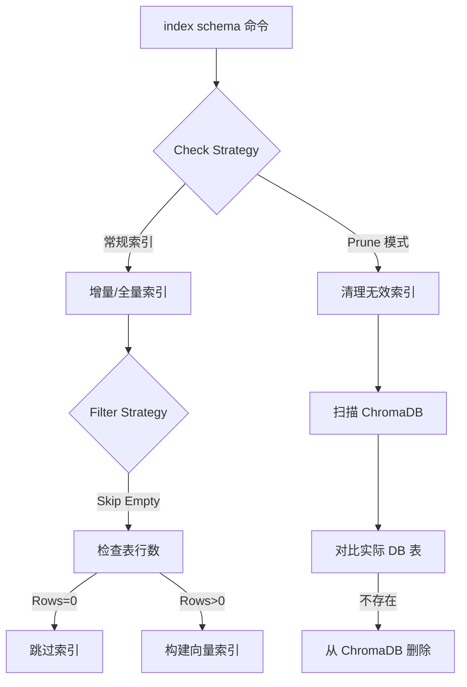

# 自动化清理空表与幽灵表索引计划

> **Status**: Planning
> **Date**: 2026-03-13
> **Goal**: 解决 "Knowledge Graph 索引不同步" 和 "空表污染检索结果" 问题，通过自动化手段清理无效索引，提升 ReACT 模式下的检索质量。

## 核心问题

1.  **幽灵表 (Ghost Tables)**: 向量索引 (ChromaDB) 中存在，但实际数据库中已删除或更名的表。
2.  **空表干扰 (Empty Table Noise)**: 数据库中存在大量无数据的空表（如 `*_coupon*`），这些表被索引后占据了检索结果的前排位置，导致真正有数据的业务表被挤出 `top_k`。
3.  **人工维护成本高**: 无法手动逐个告诉 AI 忽略哪些表。

## 解决方案架构

在 `SchemaIndexer` 中引入 **"索引清理 (Pruning)"** 和 **"空表过滤 (Empty Filter)"** 机制。

---

## 实施步骤 (Implementation Steps)

### Phase 1: 基础设施增强 (Infrastructure)

- [ ] **Step 1.1: 增强 `DatabaseManager` 支持空表检测**
    - 添加 `is_table_empty(db_name, table_name)` 方法。
    - 实现策略：优先查询 `information_schema.TABLES.TABLE_ROWS` (快速)，对于关键表可选项执行 `SELECT 1 FROM table LIMIT 1` (精准)。

- [ ] **Step 1.2: 增强 `GraphStore` 支持批量删除**
    - 确保 `delete_table(table_id)` 和 `delete_field(field_id)` 方法可用且健壮。
    - 添加 `get_all_table_ids()` 方法，用于获取当前索引中的所有表 ID。

### Phase 2: 索引器改造 (Indexer Logic)

- [ ] **Step 2.1: 修改 `SchemaIndexer` 添加空表过滤**
    - 在 `index_database` 和 `_index_single_table` 流程中加入 `skip_empty_tables` 开关。
    - 默认开启该开关（或通过配置开启）。
    - 记录被跳过的空表日志。

- [ ] **Step 2.2: 实现 "幽灵表" 清理逻辑**
    - 在 `SchemaIndexer` 中添加 `prune_invalid_entries()` 方法。
    - 逻辑：获取 ChromaDB 所有 ID -> 获取数据库实际表列表 -> 计算差集 -> 执行删除。

### Phase 3: CLI 命令集成 (CLI Integration)

- [ ] **Step 3.1: 更新 `index schema` 命令参数**
    - 添加 `--prune`: 执行索引前先清理幽灵表。
    - 添加 `--include-empty`: 强制索引空表（默认跳过）。
    - 示例：`index schema --prune` (推荐日常维护使用)。

### Phase 4: 验证与测试 (Verification)

- [ ] **Step 4.1: 单元测试**
    - 测试空表检测逻辑。
    - 测试清理逻辑是否正确识别差异。
- [ ] **Step 4.2: 集成测试**
    - 运行 `index schema --prune`。
    - 检查日志，确认 `...coupon...` 等空表被跳过。
    - 运行 ReACT 查询 `查一下沪BAB1565...`，确认检索结果中不再出现无关空表。

---

## 预期效果

1.  **检索精准度提升**: `top_k=10` 的结果中有效表占比将大幅提高。
2.  **None 问题减少**: AI 能看到真正有数据的表，从而生成正确的 SQL。
3.  **零人工干预**: 系统自动维护索引的清洁度。
