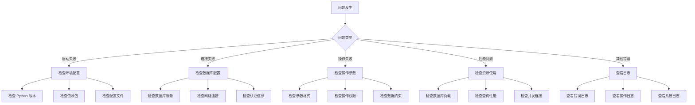

# 漕河泾停车云数据导出工具 - 故障排除指南

## 目录

1. [故障诊断流程](#故障诊断流程)
2. [常见错误及解决方案](#常见错误及解决方案)
3. [性能问题](#性能问题)
4. [监控和告警](#监控和告警)
5. [日志分析](#日志分析)
6. [联系支持](#联系支持)

---

## 故障诊断流程



---

## 常见错误及解决方案

### 1. 数据库连接错误

#### 错误 1.1: 无法连接到数据库

**错误信息**：
```
Can't connect to MySQL server on 'localhost:3306'
```

**可能原因**：
- 数据库服务未启动
- 主机名或端口错误
- 网络连接问题
- 防火墙阻止连接

**解决步骤**：

1. 检查数据库服务状态

```bash
# Windows
net start MySQL80

# Linux
systemctl status mysql
systemctl start mysql
```

2. 验证网络连接

```bash
# 测试端口是否开放
telnet localhost 3306

# 或使用 nc
nc -zv localhost 3306
```

3. 检查 `.env` 配置

```env
DB_HOST=localhost      # 确认主机名正确
DB_PORT=3306         # 确认端口正确
DB_USER=root          # 确认用户名正确
DB_PASSWORD=xxx      # 确认密码正确
DB_NAME=parkcloud    # 确认数据库名正确
```

4. 检查防火墙设置

```bash
# Windows 防火墙
netsh advfirewall firewall show rule name=all

# Linux 防火墙
sudo ufw status
sudo iptables -L
```

#### 错误 1.2: 认证失败

**错误信息**：
```
Access denied for user 'root'@'localhost'
```

**可能原因**：
- 用户名或密码错误
- 用户没有访问该数据库的权限
- 主机访问限制

**解决步骤**：

1. 验证用户名和密码

```bash
mysql -u root -p
```

2. 检查用户权限

```sql
-- 查看用户权限
SHOW GRANTS FOR 'root'@'localhost';

-- 授予权限（如有必要）
GRANT ALL PRIVILEGES ON parkcloud.* TO 'root'@'localhost';
FLUSH PRIVILEGES;
```

3. 检查主机访问限制

```sql
-- 查看允许的主机
SELECT user, host FROM mysql.user WHERE user = 'root';
```

### 2. 操作执行错误

#### 错误 2.1: 参数验证失败

**错误信息**：
```
参数 plate 格式不正确
```

**可能原因**：
- 车牌号格式不正确
- 参数类型不匹配

**解决步骤**：

1. 检查车牌号格式

正确的车牌号格式：
- 地区代码：京津沪渝冀豫云辽黑湘皖鲁新苏浙赣鄂桂甘晋蒙陕吉闽贵粤青藏川宁琼
- 字母：A-Z
- 数字/字母：5-6 位

示例：
```
正确：沪A12345、京B67890、粤C123AB
错误：沪12345、A12345、沪A123
```

2. 使用 help 命令查看参数要求

```
[MySQL/AI] > help plate_distribute
```

#### 错误 2.2: 参数缺失

**错误信息**：
```
缺少必需参数: plate (车牌号)
```

**解决步骤**：

1. 系统会提示您输入缺失的参数
2. 按照提示输入正确的值
3. 如果不知道可选值，系统会显示枚举列表

#### 错误 2.3: 参数值无效

**错误信息**：
```
参数 park_name 的值 '未知场库' 无效，可选值: 国际商务中心, 田林园, ...
```

**解决步骤**：

1. 使用 operations 命令查看所有操作
2. 使用 help 命令查看操作详情和可选值
3. 从系统提示的列表中选择有效的值

#### 错误 2.4: SQL 执行错误

**错误信息**：
```
Table 'parkcloud.plates' doesn't exist
```

**可能原因**：
- 表名错误
- 数据库选择错误
- 表不存在

**解决步骤**：

1. 使用 list tables 查看所有表

```
[MySQL/AI] > list tables
```

2. 使用 desc 命令验证表结构

```
[MySQL/AI] > desc cloud_fixed_plate
```

3. 检查 SQL 语句中的表名拼写

### 3. 意图识别错误

#### 错误 3.1: 未匹配到操作模板

**错误信息**：
```
🔄 未匹配到操作模板，使用 LLM 生成 SQL
```

**可能原因**：
- 描述不够清晰
- 操作不存在
- 使用了非标准术语

**解决步骤**：

1. 使用更清晰的描述
2. 参考 [用户操作手册](USER_GUIDE.md) 中的操作示例
3. 使用 operations 命令查看所有可用操作

示例：

```
❌ 不清晰的描述：做一下那个车牌的事
✅ 清晰的描述：下发车牌 沪ABC1234 到 国际商务中心
```

#### 错误 3.2: 置信度过低

**错误信息**：
```
✅ 识别为「plate_distribute」操作 (置信度: 45%)
⚠️ 置信度较低，请确认是否正确
```

**解决步骤**：

1. 仔细检查系统识别的操作是否正确
2. 如果不正确，提供更准确的描述
3. 或直接使用操作命令语法

### 4. 文件操作错误

#### 错误 4.1: 文件导出失败

**错误信息**：
```
❌ 导出失败: Permission denied
```

**可能原因**：
- 目录权限不足
- 磁盘空间不足
- 文件已打开

**解决步骤**：

1. 检查 output 目录权限

```bash
# Linux/Mac
chmod 755 output/
chown $(whoami) output/

# Windows
# 右键 output 文件夹 -> 属性 -> 安全
```

2. 检查磁盘空间

```bash
# Linux/Mac
df -h

# Windows
wmic logicaldisk get size,freespace,caption
```

3. 关闭可能占用文件的程序

#### 错误 4.2: 文件名包含特殊字符

**错误信息**：
```
❌ 导出失败: Invalid filename
```

**解决步骤**：

避免在文件名中使用以下字符：
```
Windows: \ / : * ? " < > |
Linux/Mac: / (斜杠)
```

---

## 性能问题

### 问题 1: 查询执行缓慢

**症状**：
- 查询时间超过 10 秒
- 系统提示"平均执行时间过长"告警

**诊断步骤**：

1. 检查是否缺少索引

```sql
-- 查看表的索引
SHOW INDEX FROM cloud_fixed_plate;

-- 查看查询执行计划
EXPLAIN SELECT * FROM cloud_fixed_plate WHERE plate = '沪A12345';
```

2. 优化 SQL 查询

```sql
-- 避免 SELECT *
SELECT plate, name, phone FROM cloud_fixed_plate WHERE plate = '沪A12345';

-- 添加 LIMIT 限制结果数量
SELECT * FROM cloud_fixed_plate LIMIT 1000;
```

3. 添加必要的索引

```sql
-- 为常用查询字段添加索引
CREATE INDEX idx_plate ON cloud_fixed_plate(plate);
CREATE INDEX idx_create_time ON cloud_fixed_plate(create_time);
```

### 问题 2: 内存占用过高

**症状**：
- 程序占用大量内存
- 系统变慢

**解决步骤**：

1. 限制查询结果数量

```sql
-- 使用 LIMIT
SELECT * FROM cloud_fixed_plate LIMIT 1000;
```

2. 分批处理大量数据

```sql
-- 使用分页
SELECT * FROM cloud_fixed_plate LIMIT 1000 OFFSET 0;
SELECT * FROM cloud_fixed_plate LIMIT 1000 OFFSET 1000;
```

3. 调整数据库连接池大小

编辑 `src/db_manager.py`：

```python
self.engine = create_engine(
    self.db_url,
    poolclass=QueuePool,
    pool_size=3,        # 减小连接池大小
    max_overflow=5,      # 减小最大溢出连接
    pool_recycle=3600
)
```

### 问题 3: 数据库连接超时

**症状**：
```
OperationalError: MySQL server has gone away
```

**解决步骤**：

1. 增加 `wait_timeout` 设置

```sql
-- 查看当前设置
SHOW VARIABLES LIKE 'wait_timeout';

-- 临时修改（重启后失效）
SET GLOBAL wait_timeout = 28800;  -- 8 小时
```

2. 永久修改（修改 my.cnf）

```ini
[mysqld]
wait_timeout = 28800
interactive_timeout = 28800
```

3. 调整应用连接回收时间

编辑 `src/db_manager.py`：

```python
self.engine = create_engine(
    self.db_url,
    poolclass=QueuePool,
    pool_recycle=7200  # 2 小时回收连接
)
```

---

## 监控和告警

### 监控指标

系统监控以下指标：

| 指标 | 说明 | 阈值 |
|------|------|------|
| 错误率 | 失败操作占比 | 10% |
| 平均执行时间 | 操作平均耗时 | 5 秒 |
| 操作总数 | 窗口内操作数 | - |
| 成功操作数 | 成功的操作数 | - |
| 失败操作数 | 失败的操作数 | - |

### 告警级别

- **warning**：轻微超出阈值
- **error**：明显超出阈值
- **critical**：严重超出阈值

### 配置告警

编辑 `main.py` 中的监控系统初始化：

```python
alert_manager = AlertManager(
    metrics_collector=metrics_collector,
    error_rate_threshold=0.1,   # 错误率阈值
    avg_duration_threshold=5.0,   # 执行时间阈值
    cooldown_period=60,            # 冷却期（秒）
    dedup_window=300,             # 去重窗口（秒）
    notifiers=[LogNotifier()]       # 通知器
)
```

### 查看告警

告警记录在以下位置：

```
logs/operation.log        # 结构化日志
logs/operation_error.log # 错误日志
```

### 调整告警阈值

根据实际情况调整阈值：

```python
# 调整为更严格的阈值
error_rate_threshold=0.05,     # 5% 错误率
avg_duration_threshold=3.0,     # 3 秒执行时间

# 调整为更宽松的阈值
error_rate_threshold=0.2,       # 20% 错误率
avg_duration_threshold=10.0,     # 10 秒执行时间
```

---

## 日志分析

### 日志文件位置

```
logs/
├── mysql_ai.log          # 主应用日志
├── mysql_ai_error.log    # 应用错误日志
├── operation.log        # 操作日志（结构化 JSON）
└── operation_error.log   # 操作错误日志（结构化 JSON）
```

### 日志级别

- **DEBUG**：调试信息
- **INFO**：常规信息
- **WARNING**：警告信息
- **ERROR**：错误信息
- **CRITICAL**：严重错误

### 分析日志

#### 1. 查看最近的错误

```bash
# Linux/Mac
tail -f logs/mysql_ai_error.log

# Windows PowerShell
Get-Content logs\mysql_ai_error.log -Tail 20 -Wait
```

#### 2. 搜索特定错误

```bash
# Linux/Mac
grep "connection failed" logs/mysql_ai.log

# Windows
Select-String -Path logs\mysql_ai.log -Pattern "connection failed"
```

#### 3. 分析操作日志（JSON）

```bash
# 使用 jq 解析 JSON
cat logs/operation.log | jq '. | select(.event == "alert")'

# 查看最近的告警
tail -100 logs/operation.log | jq '. | select(.event == "alert")'
```

#### 4. 统计操作类型

```bash
cat logs/operation.log | jq -r '.operation_type' | sort | uniq -c
```

### 日志轮转

日志使用轮转机制，避免文件过大：

- 单个文件最大：10 MB
- 保留文件数：5 个
- 总共保留：50 MB

---

## 联系支持

### 收集诊断信息

在联系支持之前，请收集以下信息：

1. **系统信息**

```bash
# 操作系统
uname -a  # Linux/Mac
systeminfo | findstr /B /C:"OS Name"  # Windows

# Python 版本
python --version

# 依赖包版本
pip list
```

2. **配置信息**

```bash
# 数据库配置（隐藏密码）
cat .env | sed 's/DB_PASSWORD=.*/DB_PASSWORD=*** /'
```

3. **错误日志**

```bash
# 最近的错误日志
tail -100 logs/mysql_ai_error.log > error_log.txt
```

4. **操作日志**

```bash
# 最近的操作日志
tail -100 logs/operation.log > operation_log.txt
```

### 报告问题

请通过以下方式报告问题：

1. 创建 Issue
2. 附上诊断信息
3. 描述复现步骤
4. 提供预期结果和实际结果

### 常用诊断命令

```bash
# 检查数据库连接
python -c "from src.db_manager import DatabaseManager; DatabaseManager().get_connection()"

# 检查知识库加载
python -c "from src.knowledge import KnowledgeLoader; from src.db_manager import DatabaseManager; kl = KnowledgeLoader(DatabaseManager()); print(len(kl.get_all_operations()))"

# 查看系统统计
python -c "from src.monitoring import MetricsCollector; mc = MetricsCollector(); import json; print(json.dumps(mc.get_stats(), indent=2))"
```

---

**文档版本**: 1.0
**最后更新**: 2026-03-04
